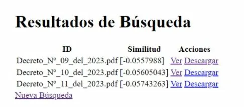

# 🔍 Buscador de Decretos Municipales

Motor de búsqueda sobre documentos municipales no estructurados, desarrollado como proyecto de tesis para la Universidad de Valparaíso. Implementa recuperación de información booleana con índice invertido, ranking por TF-IDF y similitud del coseno, y análisis semántico mediante BERT en español.

---

## ¿Qué problema resuelve?

El portal municipal vigente retorna prácticamente la totalidad del corpus ante cualquier consulta, sin filtrado relevante. Este sistema implementa búsqueda multi-término con intersección en índice invertido, entregando únicamente los documentos que contienen los términos buscados, ordenados por relevancia.

---

## Demo

**Pantalla de búsqueda**


**Resultados filtrados por relevancia**



---

## Tecnologías

| Categoría | Herramientas |
|---|---|
| Lenguaje | Python |
| Framework web | Flask |
| Base de datos | MongoDB |
| NLP / ML | BERT (`dccuchile/bert-base-spanish-wwm-cased`), Scikit-learn, Pandas, NumPy |
| Recuperación de información | Índice invertido, TF-IDF, similitud del coseno |
| Indexación | Crawler con actualización automática |

---

## Arquitectura del sistema

```
documentos PDF
      │
      ▼
  crawler.py          ← indexa y actualiza documentos automáticamente
      │
      ▼
  MongoDB             ← almacena índice invertido y metadatos
      │
      ▼
  app.py (Flask)      ← interfaz web de búsqueda
      │
      ▼
  procesar_consulta.py + ranking.py   ← TF-IDF, coseno, BERT
      │
      ▼
  resultados ordenados por relevancia
```

---

## Instalación y uso

### Requisitos previos

- Python 3.9+
- MongoDB corriendo localmente en `mongodb://localhost:27017/`

### 1. Clonar el repositorio

```bash
git clone https://github.com/RenzoReyesR/buscador-decretos-municipales.git
cd buscador-decretos-municipales
```

### 2. Instalar dependencias

```bash
pip install -r requirements.txt
```

### 3. Configurar rutas

En `config.py`, ajusta `BASE_DIR` si es necesario (por defecto apunta al directorio del proyecto) y `RUTA_DOCUMENTOS` a la carpeta con los PDFs a indexar.

### 4. Indexar documentos

```bash
python crawler.py
```

Esto procesa los PDFs, construye el índice invertido y lo almacena en MongoDB.

### 5. Levantar la aplicación

```bash
python app.py
```

Abrir en el navegador: `http://localhost:5000`

---

## Estructura del proyecto

```
├── app.py                          # Aplicación Flask principal
├── crawler.py                      # Indexación de documentos PDF
├── crawler_daemon.py               # Daemon para actualización automática
├── facade.py                       # Capa de abstracción del sistema
├── procesar_consulta.py            # Procesamiento y normalización de consultas
├── ranking.py                      # Algoritmos de ranking (TF-IDF, coseno)
├── generar_embeddings.py           # Generación de embeddings con BERT
├── actualizar_embeddings.py        # Actualización incremental de embeddings
├── actualizar_indice_invertido.py  # Actualización del índice invertido
├── indice_a_db_posting_list.py     # Carga del índice a MongoDB
├── config.py                       # Configuración general
├── config_db.py                    # Configuración de MongoDB
├── templates/                      # Vistas HTML (Flask)
└── requirements.txt
```

---

## Autor

**Renzo Reyes Ronconi**
Ingeniería Civil Informática — Universidad de Valparaíso, 2024
[LinkedIn](https://www.linkedin.com/in/renzo-reyes-ronconi/) · [GitHub](https://github.com/RenzoReyesR)
